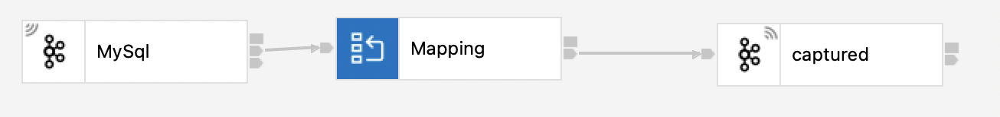
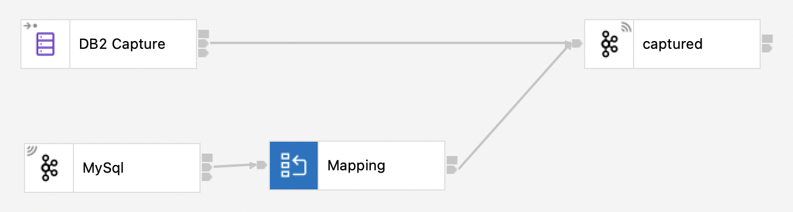

AppConnect Enterprise Change Data Capture with Debezium
=======================================================
[Change Data Capture (CDC)](https://www.redhat.com/en/topics/integration/what-is-change-data-capture) has been around for a long time, and the only out-of-the-box method for doing it with IIB/ACE has been to use our DatabaseInput node with Trigger functionality within the Database.  This has the downside that the Trigger will be performed within the transaction boundary and hence may introduce a delay in the original transaction. (Though this is an upside for some; if you want the triggered execution to be tied to the original transaction, then definitely *keep* using Triggers!).
The preferred method of performing CDC for many is therefore to look at the database logs, which will happen on a separate thread (or even in a separate process) to the original transaction.
Whilst we're working on integrating this into the product for the future, I'd like to show you how it can be done with current versions using KafkaConnect and Debezium.

Debezium?
---------
[Debezium](https://debezium.io) is an Open Source CDC tool written in Java and built on top of Kafka. It has support for [many](https://debezium.io/documentation/reference/stable/connectors/index.html) databases and can be set up both within and outside a Kubernetes / OpenShift environment.

What you need
-------------
There are a few things I'm going to assume you have set up already, just because this would be a very long page if we did everything from scratch!

1. IBM Integration Bus v10 or IBM App Connect Enterprise. If you don't have one already, you can use the [Developer edition](https://www.ibm.com/docs/en/app-connect/12.0?topic=enterprise-download-ace-developer-edition-get-started).
1. A Database, one of the ones in the supported list above would be best.  The easiest one to use with Debezium if you're just playing is probably MySQL, though SQL Server was almost just as easy.
1. A Kafka cluster; I used [Strimzi](https://strimzi.io) in a small Kubernetes cluster, but standalone is fine.
1. A way to drive changes in the Database.  I used a small flow in ACE to make changes (driven by a Kafka message, though HTTP input with the flow exerciser is arguably an easier method). You could also use simple SQL in your chosen DBs command line tool.

Using Debezium to Connect your Database to Kafka
------------------------------------------------
We use a tool called KafkaConnect to do this for us.  If you're using a standalone Kafka instance, I'd suggest simply following the [Debezium tutorial](https://debezium.io/documentation/reference/1.9/tutorial.html), or if you're using Strimzi then follow [this blog](https://strimzi.io/blog/2020/01/27/deploying-debezium-with-kafkaconnector-resource/), or this [Debezium Kubernetes Documentation](https://debezium.io/documentation/reference/stable/operations/kubernetes.html) page.

You now have CDC messages in a Kafka queue, let's read them!

Reading the CDC messages with IIB/ACE
-------------------------------------
A simple flow to take the CDC messages from Debezium and reformat them looks like this:


    
We don't need to set anything special in the properties, but choose JSON domain for the Input Message Parsing.  I created a JSON Schema from an example message (`debezium.schema.json`, not sure which one it was, but I used an online schema generator), this one expects the message to contain a `book` and `borrower` field (I'm using a library lending database, the table I'm capturing on contains the borrower and book they've borrowed). I also created a schema for what I wanted my output to look like and then used a Mapping node to map them, mapping the book to a `book_id`, the borrower straight over, and the operation type (`JSON.Data.payload.op`; part of the metadata in the message; whether it's an Insert, Update or Delete).
Finally I sent it on to a second Kafka queue for displaying on a little web page.

That simple, huh?
-----------------
Yes and no.
In principle yes, and I'd expect it's straighforward for most users.  If you're like me, you're not like most users however! There are some areas that complicate matters a little:

1. If you've built up your own Kubernetes cluster by hand (because you were learning about Kubernetes a while ago and just continued using the cluster for other stuff...) you might have used CRI-O rather than Docker runtime.  In which case you'll have a [little fight on your hands getting the Kaniko engine working](https://github.com/strimzi/strimzi-kafka-operator/discussions/7179), but it does work eventually if you follow the changes given in the link. See the `buildContainer`/`securityContext` section in the connect cluster yaml later for the TL;DR.
1. When using SQL Server you follow the instructions [here](https://debezium.io/documentation/reference/stable/connectors/sqlserver.html#setting-up-sqlserver) you need to provide it with a filegroup ("The named filegroup must already exist. It is best not to locate change tables in the same filegroup that you use for source tables."), I was using SQL Server on a kubernetes cluster (created following [these excellent instructions](https://learn.microsoft.com/en-us/sql/linux/quickstart-sql-server-containers-kubernetes?view=sql-server-ver16)) so I created some new files in the mounted PV by using sqlcmd and following [these instructions](https://database.guide/how-to-add-a-filegroup-to-a-sql-server-database-t-sql/), you just need a single `ndf` file in the filegroup. Oh an a word to the wise; check your spelling! I wasted half a day trying to figure out why I was getting this error in the Debezium Connector logs: `CDC is enabled for table Capture instance "mqsi_Lending" [...] but the table is not whitelisted by connector`, it turns out that I called my test table `Lending` but my KafkaConnector definition had `Library`, so of course they didn't match.
1. You decide to use DB2 in the above cluster for your first attempt at CDC, even though it was clearly not the preferred choice by Debezium. Your Mileage May Vary, but I made a mistake I think, so that after getting one message through it stopped working, when I restarted the pod it complained about not finding its schema store.  So I deleted and recreated the connector but it still didn't work, so I deleted all the Kafka topics and it *still* didn't work; so I gave up.  But then I realised that the architecture that Debezium uses for DB2 allows us to get the data straight into IIB/ACE via the DatabaseInput node (i.e. populating the Event Input table using CDC rather than Triggers), which worked beautifully. I ended up with a flow like this:

You can see the source code for the DatabaseInput node in `capture_DB2_Capture.esql`, as you can see it's pretty basic and needs two specific improvements: 1. The latest read Key is stored as a `SHARED INT` which means it'll reset every time the node restart (the fix would be to store it in some sort of persistent system to store data...) and 2. It never removes any entries from the table so would grow very large over time (the fix would be to delete the row from the DB in `EndEvent` rather than just updating the Key, this would even solve #1 above!). The reason I kept it this way is that it makes it easier to test the functionality if there are loads of entries in the event table.


Here's the configuration I needed to get SQL Server working, it's *mostly* the same as the docs.

1. Creating the KafkaConnect container, I used the following `yaml` to cause the Strimzi Operator to start it (see `debezium_kafka_connect_cluster_mysql.yaml`):
```yaml
apiVersion: kafka.strimzi.io/v1beta2
kind: KafkaConnect
metadata:
  name: debezium-mssql-cluster
  namespace: kafka
  annotations:
    strimzi.io/use-connector-resources: "true"
spec:
  version: 3.1.0
  replicas: 1
  bootstrapServers: my-cluster-kafka-bootstrap:9092
  config:
    config.providers: secrets
    config.providers.secrets.class: io.strimzi.kafka.KubernetesSecretConfigProvider
    group.id: mssql-cluster
    offset.storage.topic: mssql-cluster-offsets
    config.storage.topic: mssql-cluster-configs
    status.storage.topic: mssql-cluster-status
    # -1 means it will use the default replication factor configured in the broker
    config.storage.replication.factor: -1
    offset.storage.replication.factor: -1
    status.storage.replication.factor: -1
  build:
    output:
      type: docker
      image: appconnect-docker-local.artifactory.swg-devops.com/test/amartens/debezium-connect-mssql:latest
      #additionalKanikoOptions: [--insecure]
      pushSecret: jfrogcred
    plugins:
      - name: debezium-mssql-connector
        artifacts:
          - type: tgz
            url: https://repo1.maven.org/maven2/io/debezium/debezium-connector-sqlserver/1.9.6.Final/debezium-connector-sqlserver-1.9.6.Final-plugin.tar.gz
  template:
    pod:
      imagePullSecrets:
        - name: jfrogcred
    buildContainer:
      securityContext:
        capabilities:
          add: ["CHOWN", "DAC_OVERRIDE","FOWNER","SETFCAP","SETGID","SETUID"]
  externalConfiguration:
    volumes:
      - name: connector-config
        secret:
          secretName: mssql-credentials
```
Things of note:

- the `name` is simply "debezium-mssql-cluster", so that I can differentiate between other debezium clusters.  I *could* just install all the connector jars in a single cluster, but that feels a bit much like putting all my eggs in a single basket.
- the `build` section defines how to create the container image using `kaniko`, to get it working under my kube environment I added the `buildContainer`/`securityContext` section.
- the `secret` mssql-credentials that I reference didn't actually work in the end, more on that later.
- I was uploading the built image to a jfrog artifactory, hence the `jfrogcred` and `image` target.

2. Then creating the KafkaConnector to run in the above container, I used the following `yaml` to launch it (see `debezium_kafka_connect_connector_mysql.yaml`):
```yaml
apiVersion: kafka.strimzi.io/v1beta2
kind: KafkaConnector
gen_bridge_metadata:
  name: debezium-mssql-connector
  namespace: kafka
  labels:
    strimzi.io/cluster: debezium-mssql-cluster
spec:
  class: io.debezium.connector.sqlserver.SqlServerConnector
  tasksMax: 1
  config:
    database.hostname: mssql-deployment.mssql
    database.port: 1433
    database.user: mqsi
    database.password: ${PW}
    database.dbname: mqsi
    database.server.name: mssql
    table.include.list: mqsi.Lending
    database.history.kafka.bootstrap.servers: my-cluster-kafka-bootstrap:9092
    database.history.kafka.topic: dbhistory.mssql
```
Things of note:

- the `database.hostname` is using an internal kubernetes name (so the `mssql-deployment` service in the `mssql` namespace), if it's external then use it's proper name for your network
- the `database.user` is "mqsi", replace this with whatever user you have created.
- the `database.password` is hardcoded in the yaml file.  This is possibly a Bad Thing, there's meant to be a reference to the previously declared "mssql-credentials" but that didn't work for me. It should have been `${secrets:kafka/mssql-credentials:password}` and `${secrets:kafka/mssql-credentials:username}` for the above `database.user` field. (where `kafka` is the namespace I've been creating my KafkaConnect pods and `mssql-credentials` the name of the `Secret`.
- the `strimzi.io/cluster: debezium-mssql-cluster` line is needed to connect to the previously defined connect cluster, since I changed the name.

After creating the KafkaConnector, tail the logs of the Cluster pod created in the previous step, *that's* where the progress / errors will appear.
